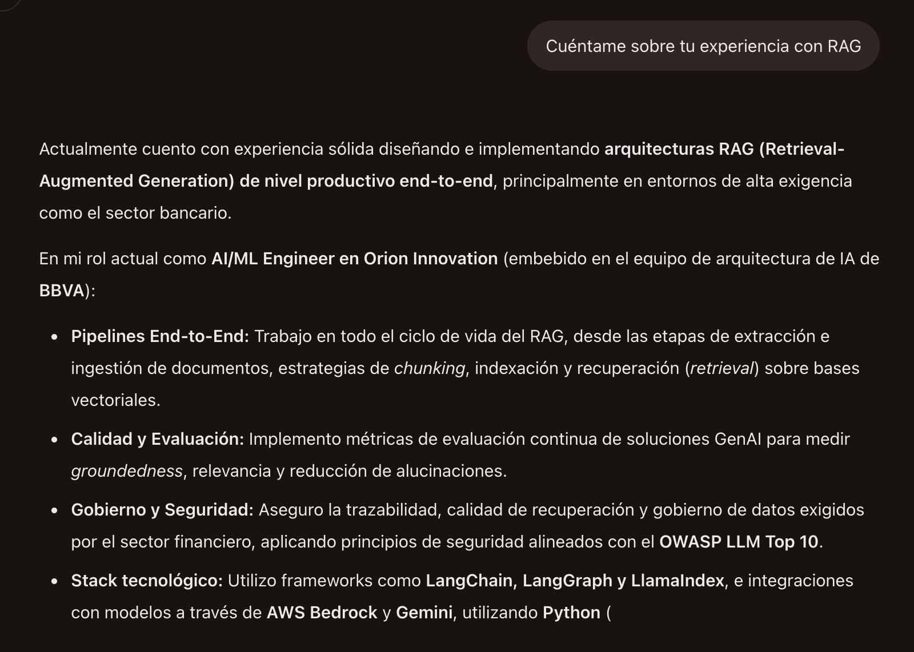

# Agente de CV — compatible con Open Responses

Agente conversacional sobre CV, construido para el **Reto IA Banorte**.

## 1. Arquitectura

```
1. Cliente (plataforma del reto)
   │  POST /v1/responses
   │  Authorization: Bearer <AGENT_API_KEY>
2. FastAPI (app/main.py)
   │  1. valida la API key del consumidor
   │  2. arma el system prompt a partir de cv_profile.json
   │  3. reconstruye el historial via previous_response_id
3. Gemini API (GEMINI_API_KEY — variable de entorno del servidor)
   |
Gemini genera la respuesta -> se devuelve en formato Open Responses
```

**Contrato externo:** `POST /v1/responses`, siguiendo el shape de
[Open Responses](https://www.openresponses.org/specification) (basado en la OpenAI Responses API): `input`, `previous_response_id`, `stream`,
`output[]` con items `message`/`output_text`, `usage`, `status`, y errores
con `{"error": {"message", "type", "code"}}`. Streaming vía SSE con eventos
`response.created`, `response.output_text.delta`, `response.completed`.

**Implementación interna — decisiones y por qué:**

| Decisión | Alternativa considerada | Por qué esta |
|---|---|---|
| CV en el system prompt | RAG con vectorstore | El CV de una persona cabe entero en contexto, no es necesario hacer preguntas adicionales. un vectorstore agrega latencia, costo y una fuente extra de fallos. RAG es sobre trabajo y sobre ingeniería. |
| Historial en memoria (dict) | Redis / DynamoDB | Correcto para una demo o proceso |
| Auth propia con Bearer simple | OAuth2 completo | El reto pide explícitamente un esquema Bearer. OAuth2 sería complejidad no ssolicitqada añadida |
| FastAPI + Uvicorn en contenedor | Serverless (Lambda) | Facilita correr streaming (SSE) sin cold starts .|

**Guardrail anti-alucinación:** el system prompt instruye al modelo a usar
únicamente la fuente `cv_profile.json` y a admitir explícitamente cuando no tiene
evidencia. `cv_profile.json` es la única fuente de verdad, si algo no está
ahí, el agente no debe decirlo.

**Seguridad de credenciales:** dos claves separadas, nunca mezcladas:
- `AGENT_API_KEY`: la que la plataforma del reto manda como `Bearer`. Se
  valida en el servidor.
- `GEMINI_API_KEY`: la clave del proveedor del modelo. Vive solo como
  variable de entorno del servidor, nunca se envía al cliente ni aparece en
  los mensajes.

**Observabilidad:** cada request se loggea con un `trace_id`, latencia en ms
y tokens consumidos (sin loggear la API key). 

## 2. Correr en local

```bash
cp .env.example .env
pip install -r requirements.txt
uvicorn app.main:app --reload --port 8080
```

Prueba:

```bash
curl -X POST http://localhost:8080/v1/responses \
  -H "Authorization: Bearer <AGENT_API_KEY>" \
  -H "Content-Type: application/json" \
  -d '{"input": "Cuéntame sobre tu experiencia con RAG"}'
```

## 3. Próximos pasos posibles

- Mover el historial de conversación a Redis/DynamoDB con TTL (ya aislado
  detrás de `_conversations`.
- Rate limiting por API key.
- Rotación de `AGENT_API_KEY` sin downtime.

## 4. Casos de prueba cubiertos (`tests/test_api.py`)

- Pregunta directa con respuesta fundamentada en el perfil.
- Pregunta sin evidencia en el CV -> el agente lo admite en vez de inventar.
- Conversación de varios turnos vía `previous_response_id`.
- `previous_response_id` desconocido -> 400.
- API key ausente / inválida -> 401.
- Input vacío / demasiado largo -> 400.
- Error temporal del proveedor del modelo -> 502 (no se cae el servicio).

## 4.1 Nota observada en operación: 503 de Gemini bajo demanda alta

Durante pruebas contra el deploy real se observó esto en los logs de Render:

```
ERROR trace=<id> status=upstream_error code=503 detail=503 UNAVAILABLE.
{'error': {'code': 503, 'message': 'This model is currently experiencing
high demand. Spikes in demand are usually temporary. Please try again
later.', 'status': 'UNAVAILABLE'}}
```

Esto no es un bug del servicio,  es lo gratuito de `gemini-3.6-flash`
rechazando temporalmente la request por saturación del lado de Google. El
comportamiento es el esperado por diseño: el `except Exception` en
`create_response` clasifica el error por su código HTTP (`503` cae en el
rango 400-599), lo loggea con `trace_id` para poder rastrearlo, y responde
`502 upstream_error` al cliente en vez de caerse o devolver un 500 genérico.


## Ejemplo en la plataforma



**Nota:** Si se hace la primera prueba, probablemente el modelo tarde en responder, ya que render tarda un poco en iniciar.

